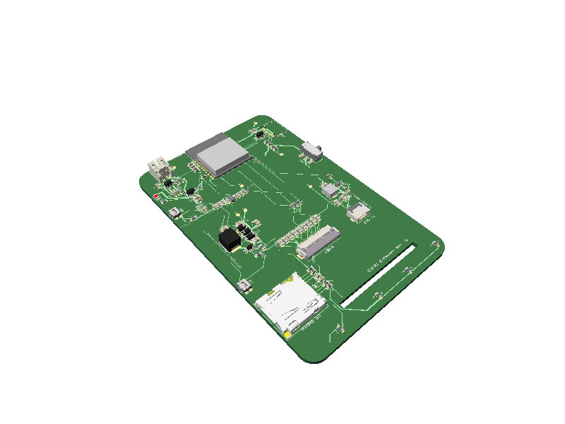
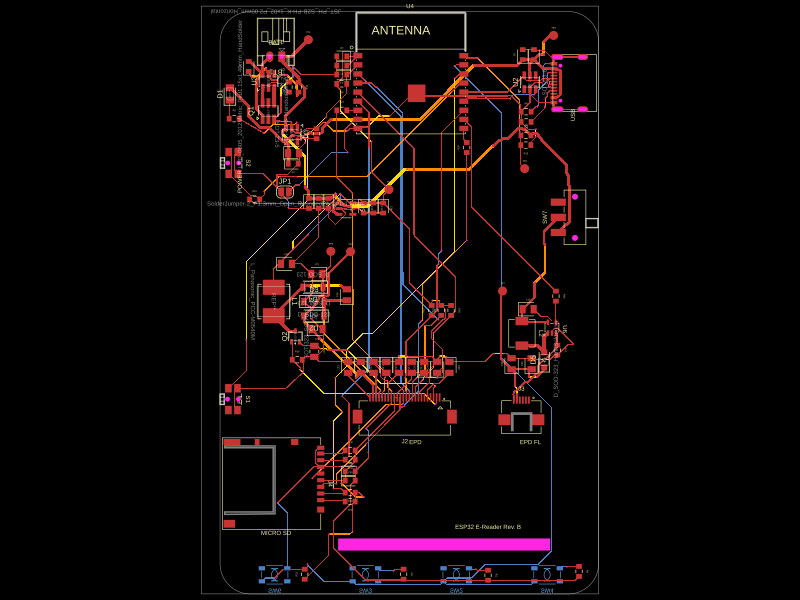

# ESP32 E-Reader Rev. B

A four-layer, battery-powered e-reader PCB built around the ESP32-C3 and a
high-resolution four-color e-paper display. This repository contains the
[tscircuit](https://tscircuit.com/) implementation of the Rev. B hardware,
including the schematic, PCB layout, component data, and fabrication export
workflow.



## Display

The intended display is the **EastRising ER-EPD3.97-1RY**.

| Specification | Value |
| --- | --- |
| Display type | Reflective black, white, red, and yellow e-paper |
| Diagonal | 3.97 inches |
| Resolution | 480 × 800 pixels |
| Controller | SSD2677 |
| Interface | 4-wire SPI |
| E-paper connector | 24-pin, 0.5 mm-pitch FPC (J2) |

J2 is a Hirose `FH12-24S-0.5SH(55)` connector. The board provides the panel's
SPI signals and the external high-voltage bias network required by the
SSD2677. This reflective display has no frontlight, so the former frontlight
connector and boost-driver circuit are not fitted.

The centered 35 × 2 mm PCB slot allows a display FPC to pass from the front of
the assembly to the connector side. A panel whose integral tail cannot reach
J2 requires a 24-conductor, 0.5 mm-pitch extension cable and an appropriate
24-pin FPC/FFC coupler. Select the cable contact orientation (same-side or
opposite-side contacts) only after checking pin 1 at both the display tail and
J2; reversing the contact orientation reverses the pin order.

> [!IMPORTANT]
> Do not select a panel based only on the “4.2-inch” description or the 24-pin
> connector. Many e-paper panels use similar FPCs but have different pinouts,
> resolutions, controllers, dimensions, and voltage requirements. The PCB and
> firmware are designed for the **ER-EPD3.97-1RY** pinout. Verify the full
> part number before purchasing or connecting a display.

## Hardware overview

| Function | Implementation |
| --- | --- |
| MCU | ESP32-C3-WROOM-02-N4, 4 MB flash, Wi-Fi and Bluetooth LE |
| Display | EastRising ER-EPD3.97-1RY, 480 × 800 four-color e-paper |
| Storage | MicroSD card over shared SPI |
| USB | USB-C power, native USB data, CC resistors, and USB ESD protection |
| Battery | Single-cell LiPo through a 2-pin JST-PH connector |
| Charging | MCP73831-2 linear LiPo charger |
| Battery protection | DW01A with FS8205A dual MOSFET |
| Logic supply | ME6211C33M5 3.3 V LDO |
| Controls | Back, Confirm, Left, Right, Wake, Reset/Enable, and main power switch |
| Board | 62.5 × 96.16 mm, 1.6 mm thick, four copper layers |

The four navigation buttons share one ESP32 ADC input through a resistor
ladder. The e-paper display and MicroSD card share the SPI clock and MOSI lines
while using independent chip-select signals. USB D+ and D− connect directly to
the ESP32-C3's native USB pins.

The four display-side navigation controls use 6 × 6 mm, 5 mm-high,
top-actuated tactile switches on the bottom PCB layer. Their larger bodies and
actuators are intended for reliable contact with molded or printed enclosure
button plungers. The display faces the same side; the main circuitry remains on
the top PCB layer.

## Board construction

The layer arrangement is:

```text
Top      — components and signals
Inner 1  — GND plane
Inner 2  — 3.3 V plane
Bottom   — components and signals
```

Ground fills are also present on the top and bottom layers. The
ESP32-C3-WROOM-02 antenna area has a keepout across all four copper layers.
The design uses 0.2 mm signal traces, wider power and e-paper charge-pump
routes, and 0.2/0.42 mm via drill/pad diameters.



## Repository layout

```text
.
├── index.circuit.tsx       # Board outline, planes, keepouts, and net routing
├── circuit-sections.tsx    # Functional schematic sections and components
├── design-data.ts          # Parts, placement, sourcing, nets, and trace widths
├── imports/                # Imported component footprints and models
├── __snapshots__/          # PCB, schematic, and 3D reference renders
├── tscircuit.config.json   # tscircuit project configuration
└── package.json            # Build, validation, and export commands
```

The design currently contains 85 components and 49 connected nets. Placement,
board geometry, and electrical intent are transcribed from the Rev. B KiCad
design; PCB routing is generated from the netlist by tscircuit's local
autorouter.

## Getting started

Install [Bun](https://bun.sh/) and then install the project dependencies:

```sh
bun install
```

Open the interactive tscircuit development view:

```sh
bun run dev
```

Type-check and build the design:

```sh
bun run typecheck
bun run build:pcb
```

`build:pcb` also generates a PCB preview image. For a longer release build with
an increased autorouter timeout, use:

```sh
bun run build:release
```

## Validation

Run the checks in this order so connectivity errors are caught before layout
and routing issues:

```sh
bunx tsci check netlist index.circuit.tsx
bunx tsci check schematic-placement index.circuit.tsx
bunx tsci check placement index.circuit.tsx
bunx tsci check trace-length index.circuit.tsx
bunx tsci check routing-difficulty index.circuit.tsx
bunx tsci check shorts index.circuit.tsx
```

Update the checked-in schematic, PCB, and 3D snapshots with:

```sh
bun run snapshot:update
```

## Fabrication files

Generate the manufacturing archive with:

```sh
bun run export:gerbers
```

The output is written to `dist/esp32-e-reader-gerbers.zip` and includes the
four copper layers, solder mask, paste, silkscreen, fabrication and edge-cut
Gerbers, plated/non-plated drill files, BOM, and pick-and-place CSV files.

> [!CAUTION]
> This is an open hardware design, not a certified consumer product. Review the
> schematic, battery polarity, component voltage ratings, PCB clearances, BOM,
> and fabrication outputs before ordering or powering a board. E-paper bias
> rails generate voltages well above the 3.3 V logic rail.

## Design notes

- Battery, USB, and 3.3 V distribution use 0.5 mm routes.
- Pulsed e-paper charge-pump paths use 0.4–0.6 mm routes.
- Ordinary logic uses 0.2 mm routes.
- The top, bottom, and inner-1 copper layers have GND fills; inner-2 is the
  dedicated 3.3 V plane.
- SW7 is the hard main-power control. It switches the ME6211 LDO enable input
  between the battery rail and an off-state pull-down, so the switch does not
  carry the ESP32 or display load current. S2 remains a firmware wake/power
  button.
- Imported EasyEDA footprints live in `imports/`; any source-orientation
  corrections are applied there.
