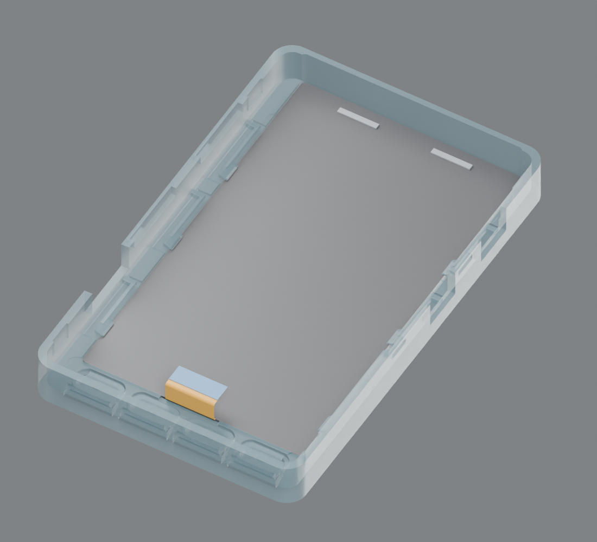
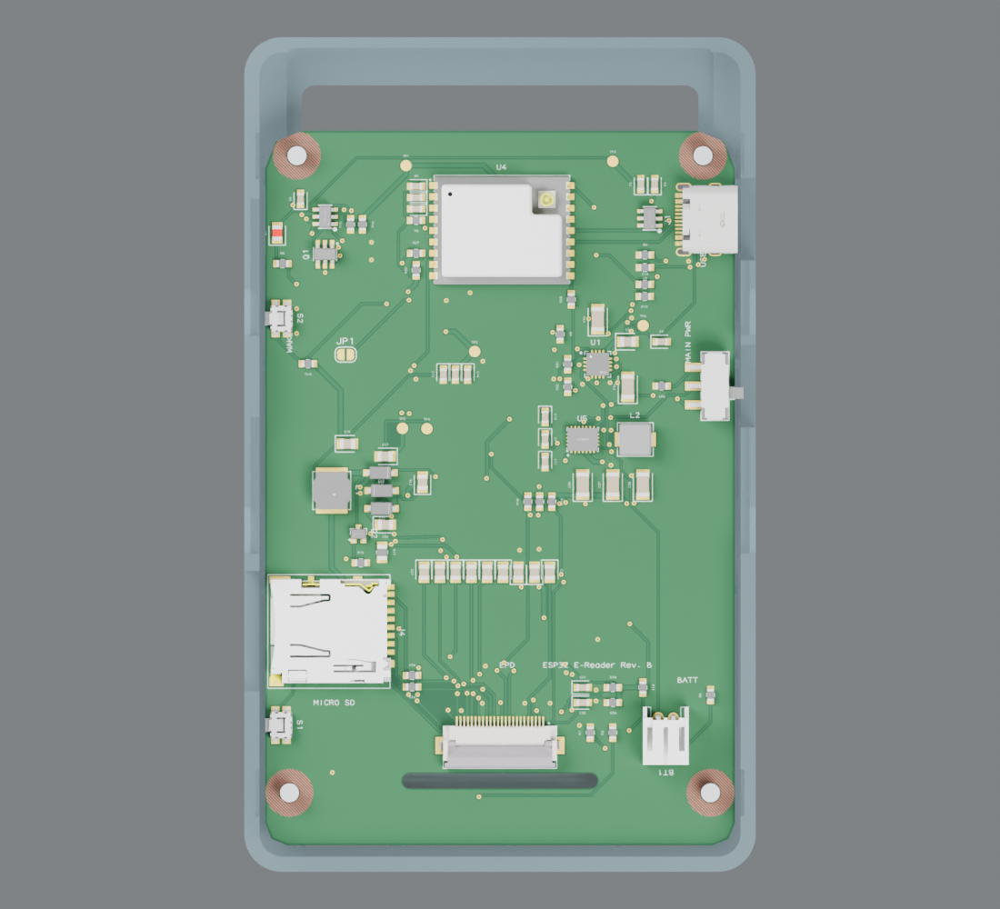
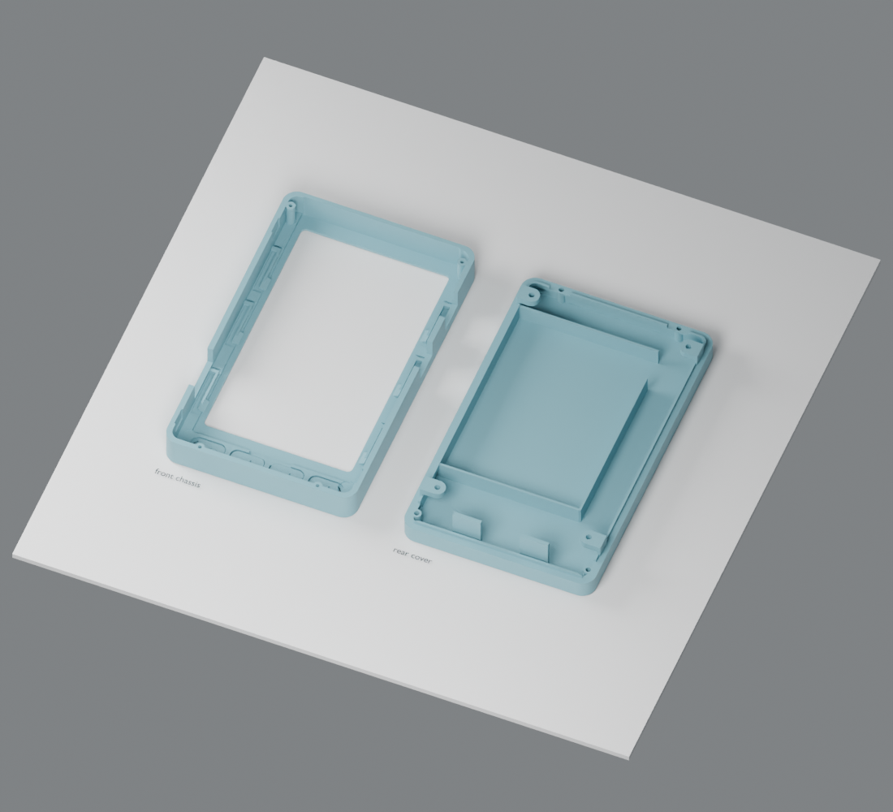

# ESP32 E-Reader Rev. B

A four-layer, battery-powered e-reader PCB built around the ESP32-C3 and a
high-resolution four-color e-paper display. This repository contains the
[tscircuit](https://tscircuit.com/) implementation of the Rev. B hardware,
including the schematic, PCB layout, component data, and fabrication export
workflow.

## At a glance

| Specification | Current design |
| --- | --- |
| Enclosure outside | 68.0 × 111.0 × **16.8 mm**; prototype CAD, not a measured print |
| PCB | 62.5 × 95.08 × 1.6 mm; four copper layers |
| Display | EastRising ER-EPD3.97-1RY, raw display only; 480 × 800, four colors, no frontlight |
| Processor | ESP32-C3-WROOM-02U-N4; 4 MB flash, Wi-Fi, Bluetooth LE, external antenna |
| Storage | MicroSD over SPI |
| Battery | Protected 1-cell LiPo, 3.7 V nominal; modeled around 2000 mAh SparkFun PRT-13855 |
| Battery envelope | 49.2 × 68.8 × 5.6 mm nominal, excluding unverified lead and plug |
| USB | USB-C for charging and native ESP32-C3 USB data |
| Input | Four recessed navigation buttons, wake, reset, main power switch |

This repository is the **hardware and printable enclosure prototype**. It
does not contain e-reader firmware. Battery runtime, display cable fit, and
final printed fit have not been measured on an assembled device.


## Display

The selected panel is the [EastRising ER-EPD3.97-1RY](https://www.buydisplay.com/3-97-inch-quad-color-e-paper-screen-e-ink-display-480x800),
identified by the user on 6 October 2026. Its [datasheet](https://www.buydisplay.com/download/manual/ER-EPD3.97-1_Datasheet.pdf)
(Rev. 1.0, 18 August 2026) specifies an SSD2677 controller, 480 × 800 pixels,
and a 56.24 × 96.62 mm panel, matching the existing display envelope.

J2 remains the Hirose FH12-24S-0.5SH(55), with 24 positions at 0.50 mm
pitch. At the user's direction, the supplier product listing is authoritative
for connector pitch in this revision. No adapter is used. The conflicting
0.80 mm drawing is recorded as a supplier documentation discrepancy, rather
than the design basis. Connector fit remains a listing-based assumption;
contact side, stiffener thickness and cable fold still need a sample fit.

The PDF pin assignments match J2's existing functions. Pins 6 (TSCL) and
7 (TSDA) are connected to GND to give the unused sensor inputs defined low
levels, as required by page 7. Pin 8 is also low for four-wire SPI.

The display uses the same connection style as the
[Linux Game Boy Advance reference](https://tscircuit.com/ShiboSoftwareDev/linux-gameboy-advance#3d):
a folded flat ribbon entering a horizontal, bottom-contact ZIF socket.
The reader uses the [24-pin Hirose FH12](https://www.hirose.com/en/product/p/CL0586-0521-0-55)
for its e-paper pinout. Open the flip latch, insert the tail straight with its
exposed contacts facing the PCB, then close the latch.

J2 and the 26 × 2 mm rounded ribbon slot share X = 0 mm. J2 is now at
Y = −32.34 mm and the slot at Y = −38.41 mm, shortening the path from the
lower panel edge. The installed model has two 0.6 mm-radius quarter bends
and an approximately 11.316 mm centerline, within the drawing's
11.27 ± 0.30 mm extension below the glass. It passes through the slot and
shows 24 bottom-facing contacts and a nominal 0.3 mm reinforced insertion tip.
The panel remains 56.24 × 96.62 × 0.9 mm at Y = 10.5 mm, Z −4.65…−3.75 mm;
the model now subtracts J2's 0.8 mm anchor height to align with the case rebate.

The [connection dimensions](assets/enclosure/display-connection.json) and
[installed ribbon preview](assets/enclosure/display-ribbon-connection.png)
describe nominal installation geometry, not OEM flex CAD. Its 12.5 mm tip
width follows the user-selected 24-pin, 0.5 mm listing specification; it does
not reproduce the conflicting PDF's 19.6 mm, 0.8 mm tip. The delivered tail's
width, contact face, reinforcement and allowable bend radius need a physical
sample. Do not force a mismatched ribbon into the socket.

> [!IMPORTANT]
> Do not select a panel based only on the “4.2-inch” description or the 24-pin
> connector. Many e-paper panels use similar FPCs but have different pinouts,
> resolutions, controllers, dimensions, and voltage requirements. The PCB and
> firmware must match the **EastRising ER-EPD3.97-1RY** pinout.
> J2 selection uses the supplier listing's 24-pin, 0.50 mm specification.

## Hardware overview

| Function | Implementation |
| --- | --- |
| MCU | ESP32-C3-WROOM-02U-N4, 4 MB flash, Wi-Fi and Bluetooth LE |
| Display | EastRising ER-EPD3.97-1RY raw 480 × 800 four-color panel |
| Storage | MicroSD card over shared SPI |
| USB | USB-C power, native USB data, CC resistors, and USB ESD protection |
| Battery | Single-cell LiPo through a 2-pin JST-PH connector |
| Charging | BQ24074 power-path LiPo charger, 500 mA USB input limit |
| Battery protection | DW01A with FS8205A dual MOSFET |
| Logic supply | TPS63021 fixed 3.3 V buck-boost converter |
| Controls | Back, Confirm, Left, Right, Wake, Reset/Enable, and main power switch |
| Board | 62.5 × 95.08 mm, 1.6 mm thick, four copper layers |

### Parts and supplies for one prototype

| Item | Selection / requirement |
| --- | --- |
| U4 microcontroller | ESP32-C3-WROOM-02U-N4 with external U.FL antenna |
| Display | EastRising ER-EPD3.97-1RY, raw display only |
| External antenna | Taoglas FXP75.07.0045B, 45 mm cable; rear-cover adhesive mount |
| J2 display connector | Hirose FH12-24S-0.5SH(55), 24 positions at 0.5 mm pitch |
| J4 MicroSD socket | Hirose DM3AT-SF-PEJM5 |
| J1 USB-C receptacle | GCT USB4105-GF-A |
| BT1 battery header | JST S2B-PH-K-S(LF)(SN), 2-pin, 2.0 mm pitch, side entry |
| Battery | Protected 3.7 V nominal single-cell pack; modeled PRT-13855, 2000 mAh, 49.2 × 68.8 × 5.6 mm |
| Navigation switches | 4 × Alps Alpine SKRPACE010, bottom-side assembly |
| Other controls | 2 × Panasonic EVQP7C01P (S1/S2); 1 × C&K JS102011SAQN (SW7) |
| Printed parts | Two: front chassis with integral keys, screen clips and latch receivers; transparent snap-fit rear cover with PCB supports and battery guides |
| Assembly supplies | 4 M2.5 × 4 mm internal PCB screws (head ≤5 mm diameter, ≤2.5 mm high), display-border pads, 0.2 mm insulating battery liner and two 0.5 mm nonconductive adhesive strips; zero cover screws |

The [source component list and LCSC/JLCPCB mappings](design-data.ts) and the
[generated BOM](#fabrication-files) cover the remaining passives, charger,
protection devices, ESD device, and e-paper bias circuit. The USB-C body is
checked against the printable case using the local GCT manufacturer OBJ;
the antenna cable and mating plug remain unmodeled. The display fold is nominal CAD. Confirm the delivered display tail, battery plug polarity,
antenna cable path, and screw fit before assembly.

The four navigation buttons share one ESP32 ADC input through a resistor
ladder. The e-paper display and MicroSD card share the SPI clock and MOSI lines
while using independent chip-select signals. USB D+ and D− connect directly to
the ESP32-C3's native USB pins.

The four front navigation controls use the same **Alps Alpine SKRPACE010**
bottom-side tactile switch listed in the [original reader's
BOM](https://github.com/IS7V4N/ESP32_E-Reader). Each switch is 4.2 × 3.2 ×
2.5 mm, with 0.2 mm travel and 2.55 N operating force according to the
[manufacturer](https://tech.alpsalpine.com/e/products/category/tact-switch/sub/02/series/skrp/).
They sit on 14 mm centers within the 62.5 mm board width. Moving the row 4 mm
closer to the display removes 5 mm from the lower PCB edge while keeping about
2 mm between the panel outline and the button openings. Four slim key caps and independent PETG leaf arms are integral to the front
chassis. This requires bottom-side switch assembly. Each key has a nominal
0.04 mm rest gap and 0.25 mm total stroke, giving about 0.21 mm switch
compression. Force, return and print fit need a physical prototype. Check the actual
display ribbon width and fold radius against the 26 mm FPC slot before ordering
the PCB.

## Dimensioned enclosure print prototype

The redesigned Rev. E enclosure uses **two printed parts** in a
**68.0 × 111.0 × 16.8 mm** envelope, 1.2 mm (6.7%) thinner than Rev. D.
Moving the same battery toward the button end avoids stacking it over the
ESP32 module. The front chassis combines the screen
ledge, six releasable padded border clips and four independently moving keys.
The transparent rear cover combines the PCB cantilever supports, battery guides,
four integral snap leaves and two extra supports for the upper screen border.

The PCB fastens to the rear cover from its display-facing underside. The
front chassis therefore has a clear path for screen installation. Four side
snap hooks engage matching receivers in the front chassis. Recessed side
windows allow releasing them with a plastic pick. Four M2.5 screws retain
the PCB; the cover uses no screws. The selected protected
[SparkFun PRT-13855 pack](https://www.sparkfun.com/lithium-ion-battery-2ah.html)
has **49.2 × 68.8 × 5.6 mm nominal dimensions**. It bonds to the inside rear
cover with two nonconductive foam adhesive strips; a thin insulating liner
covers its PCB-facing surface. No separate battery tray needs printing.
The battery is now centered at X −6.0, Y −8.5 mm and lowered from Z 4.9 to
Z 3.7. The rear wall remains 1.2 mm thick. The screen's padded ledge, six clips
and two upper supports retain their original seating positions.
Print both Rev. E shells as a pair. The battery loads through the open upper
end of its guides and slides 6.5 mm toward the lower stop before fitting the PCB.

| Thickness contribution | mm |
| --- | ---: |
| Front outer face to PCB center | 5.8 |
| PCB center to battery base | 3.7 |
| Nominal battery thickness | 5.6 |
| Battery mounting adhesive | 0.5 |
| Rear cover | 1.2 |
| **Modeled outside thickness** | **16.8** |

The battery liner has 0.25 mm nominal clearance above the lower PCB mounting
bosses and about 0.59 mm above L1. The shifted battery's liner clears the
ESP32 module by 1.63 mm in Y. These are CAD measurements; actual pack thickness,
swelling allowance, wires and printed tolerances need a prototype check.

The actual CAD materials use alpha blending: 0.38 opacity for the front,
0.22 for the rear. The hosted viewer and native export use 0.5 opacity through
the explicit translucency flags. This lets you see the components inside. Clear PETG FDM
prints are normally translucent; the CAD appearance does not predict glass-like
clarity. The design assumes a 0.4 mm nozzle and PETG flexures. Physical fit,
clip force, key fatigue, battery retention and cable routing need a prototype.



The [print ZIP](assets/enclosure/esp32-reader-printable-stls.zip) contains exactly
**two bed-oriented STLs**, the [220 × 220 mm 3MF plate](assets/enclosure/reader-print-plate.3mf),
and the [print and assembly guide](assets/enclosure/PRINTING.md). Both parts
print flat, outside face on the bed. Use removable supports under the spring
leaves and projecting features, including supports that start on the model.
The open battery pocket leaves them accessible for removal.

The [component inventory](assets/enclosure/component-inventory.csv) records
PCB references, footprint sizes and model envelopes. `bun run export:assembly`
resolves the local CAD and writes `dist/index/assembly.glb`; missing OBJ/GLB
fetches fail the export. Supplier OBJ models are bundled for browser rendering.
The supplier STEP archives ([1](assets/components/supplier-step-models-1.zip), [2](assets/components/supplier-step-models-2.zip), [3](assets/components/supplier-step-models-3.zip), [4](assets/components/supplier-step-models-4.zip), [5](assets/components/supplier-step-models-5.zip)) preserve
original source models without loading large STEP duplicates in the preview.
Source URLs and hashes remain in `assets/components/sources.json`.

Four PCB mounting holes retain their original coordinates: the upper pair at
X ±27, Y 44.75 mm and the lower pair at X ±28, Y −40 mm. Each 2.7 mm hole has
a 3.2 mm copper keepout on every layer. The board seats at Z +0.8 on rear-cover
bosses and the M2.5 × 4 mm screws enter from the underside. PCB geometry,
component placement, electrical connections and routed copper remain unchanged.
Run `bun scripts/check-pcb-mounts.mjs` after the routed build to check drills,
board edges and copper. The enclosure check verifies screwdriver access with
the front chassis removed.




The front navigation switches remain the low-profile SKRPACE010 parts. The
power switch is accessible through a side slot; a coupled thumb slider is not
included. Display flex, battery plug polarity, actual lead lengths and antenna
coax routing still require sample verification before assembly.

## Board construction

The layer arrangement is:

```text
Top      — components and signals
Inner 1  — GND plane
Inner 2  — 3.3 V plane
Bottom   — components and signals
```

Ground fills are also present on the top and bottom layers. U4 is the
external-antenna ESP32-C3-WROOM-02U variant. Its antenna cable leads to the
Taoglas FXP75 film modeled at X = 25, Y = 44 mm under the plastic rear cover.
The old PCB-antenna copper keepout has been removed.
The design requests 0.2 mm ordinary signal traces, 0.5 mm battery/USB/3.3 V
routes, and 0.4–0.6 mm e-paper charge-pump routes. Fine-pitch escapes may be narrowed by the autorouter; inspect the routed
artifact rather than assuming every segment uses the requested net width. Vias request 0.30/0.60 mm drill/pad diameters, with a 0.15 mm radial
annulus. Routing requires 0.20 mm hole-to-trace and via-hole-to-via-hole
clearance, 0.45 mm plated-hole-to-hole clearance, and 0.30 mm board-edge
clearance. Via-in-pad routing is disabled.


### JLCPCB fabrication settings

Use four-layer FR-4, 1.6 mm thickness, standard copper (1 oz outer / 0.5 oz
inner), green solder mask and standard routing tolerances. The board fits
inside 100 × 100 mm. Choose ordinary through vias and tenting, with no
blind/buried vias or filled/capped via-in-pad service. Check the live quote;
these settings target standard fabrication, not a guaranteed price.

[JLCPCB's manufacturing capabilities](https://jlcpcb.com/capabilities/pcb-capabilities/)
(accessed 6 October 2026) state that 0.20/0.25 mm holes with pads below
0.45 mm incur extra charges. The former 0.20/0.42 mm vias met that condition;
the new 0.30/0.60 mm target avoids it. The 2.7 mm mounting holes and 2 mm
ribbon slot exceed the 0.5 mm NPTH and 1 mm non-plated slot minima.
Select 0.30 mm as the order's minimum via drill only after checking the
exported drill file.

For assembly, compare lead-free HASL with ENIG in the quote and assembly
preview; J2's 0.5 mm pitch and the QFN parts benefit from ENIG's flat surface.
Double-sided assembly, extended parts and surface finish can affect cost
separately from via drilling. Retain the four layers for the present routing
and planes; a two-layer cost reduction would require a separate redesign.

## Repository layout

```text
.
├── index.circuit.tsx       # Board outline, planes, keepouts, and net routing
├── circuit-sections.tsx    # Functional schematic sections and components
├── design-data.ts          # Parts, placement, sourcing, nets, and trace widths
├── schematic-layout.ts     # Explicit positions for all 94 parts on five sheets
├── imports/                # Imported component footprints and models
├── __snapshots__/          # PCB, schematic, and 3D reference renders
├── assets/enclosure/       # Printable STLs, assembly GLBs, guide, and renders
├── scripts/                # Enclosure generation and clearance checks
├── tscircuit.config.json   # tscircuit project configuration
└── package.json            # Build, validation, and export commands
```

Placement, board geometry, and electrical intent are transcribed from the Rev. B KiCad
design; PCB routing is generated from the netlist by tscircuit's local
autorouter.

The schematic groups parts by function, with dedicated power, display,
storage, and control sections. `functional-schematic-symbols.tsx` arranges
chip pins for readable signal flow while retaining physical pin identities.
The controls sheet shows the navigation buttons on one ADC bus with their
resistors below and names beside each key. The SKRPACE010 symbol explicitly
maps its active contacts to physical pins 1 and 4. After building, run
`bun scripts/check-controls-schematic.mjs` to verify the visible bus and
resistor connections, including terminals missed by ordinary style checks.
The design reuses the verified copper from release 1.0.54, rechecked with the
four mounting holes in release 1.0.57, through
`verified-pcb-routes.json`. The cache compares the complete routing geometry,
connectivity, keepouts, widths, and rules; physical changes use the autorouter
again. Check this guard with `bun scripts/check-routing-cache.mjs`.

## Getting started

Install [Bun](https://bun.sh/) and then install the project dependencies:

```sh
bun install
```

Open the interactive tscircuit development view:

```sh
bun run dev
```

Type-check and build the design:

```sh
bun run typecheck
bun run build:pcb
```

`build:pcb` also generates a PCB preview image. For a longer release build with
an increased autorouter timeout, use:

```sh
bun run build:release
```

Cloud builds use a 40-minute worker limit from `tscircuit.config.json`. The
default 10-minute limit stopped release 1.0.51 during PCB routing, before the
schematic, PCB, and 3D artifacts could be generated.

The cloud prebuild also copies local GLB, OBJ, and STEP models into `dist` at
the paths referenced by circuit JSON, so the hosted 3D view can load them.

## Validation

Run the checks in this order so connectivity errors are caught before layout
and routing issues:

```sh
bunx tsci check netlist index.circuit.tsx
bunx tsci check schematic-placement index.circuit.tsx
bunx tsci check placement index.circuit.tsx
bunx tsci check trace-length index.circuit.tsx
bunx tsci check routing-difficulty index.circuit.tsx
bun run build:release
bunx tsci check shorts dist/index/circuit.json
```

Update the checked-in schematic, PCB, and 3D snapshots with:

```sh
bun run snapshot:update
```

The current cloud-style build completes with 228 routed traces, zero DRC
errors, and no Gerber-derived shorts across all four layers. Its 178 vias are
all 0.30/0.60 mm ordinary through vias. Netlist, schematic placement, PCB
placement, and TypeScript checks pass. Schematic style analysis reports no
issues across all five sheets. Buried-layer keepouts prevent through vias from
overlapping the USB-C contacts, U3 contacts, and C19/C20 ground pads.

The source and regenerated fabrication export ground J2 pins 6 and 7. The export guard
rejects artifacts without both sensor pins grounded. Connector pitch follows
the supplier listing at the user's direction. Physical screen-tail, battery
lead, button travel and printed-fit checks remain necessary.

## Printable enclosure



The [print package](assets/enclosure/esp32-reader-printable-stls.zip)
contains two bed-oriented STLs, a geometry-only
[3MF plate](assets/enclosure/reader-print-plate.3mf), and the
[print instructions](assets/enclosure/PRINTING.md). The separate
[STLs](assets/enclosure/print/) are also available. Files marked `DO-NOT-PRINT`
are inspection gauges. The integral keys, cover snaps and screen clips require PETG and removable
supports beneath their projecting leaves. Choose your actual printer and filament
preset before slicing; no printer-specific G-code is supplied.

To regenerate the meshes from source, install Blender and run:

```sh
blender --background --python-exit-code 1 --python scripts/generate-printable-enclosure.py
```

The generator updates the STL files, matching GLBs for the tscircuit
assembly, mesh checks, and ZIP package. The [print guide](assets/enclosure/PRINTING.md)
also gives the component-clearance and preview-render commands.

After the release checks pass, commit the source and publish with
`bun run push:release`, then push the commit to GitHub. This command runs
`tsci push` from the committed runtime files, with original STEP
models in their small ZIP archives, because direct `tsci push`
does not honor `.gitignore` and can upload local check fixtures and caches.
Prebuild restores downloads and PNG previews from tracked STEP/STL/JSON sources
because the Git importer omits ZIP and image files. Re-rendering also refreshes
the checksummed preview restore sources.

## Fabrication files

Generate the manufacturing archive with:

```sh
bun run build:release
bun run export:gerbers
```

`export:gerbers` uses the just-built `dist/index/circuit.json`, so it does not
routinely rerun the autorouter. The output is written to
`dist/esp32-e-reader-gerbers.zip` and includes the
four copper layers, solder mask, paste, silkscreen, fabrication and edge-cut
Gerbers, plated/non-plated drill files, BOM, and pick-and-place CSV files.
All BOM rows have JLCPCB part numbers, including the four SKRPACE010
navigation switches (C139797). U1, U2, U3, U4, U5, L2, SW2, SW3, SW4, and
SW6 use imported supplier footprints for assembly placement. `export:gerbers`
checks the BOM, critical placement rows, absence of build errors, centered J2,
through-via geometry, and the actual minimum plated drill before accepting
the archive.

The exporter still warns about SW7 because its three straight-line pads do not
give the pin-1 detector a corner. SW7 uses the exact C221660 supplier footprint;
the [C&K terminal drawing](https://www.ckswitches.com/media/1434/slides.pdf)
shows terminal 1 at the left end of that row. With the footprint rotated 90° on
the board, pad 1 is the bottom pad. The export check requires SW7 on the top
side at 90°. Confirm the SW7 orientation in the assembler's placement preview.

> [!CAUTION]
> This is a prototype hardware design, not a certified consumer product. Review the
> schematic, battery polarity, component voltage ratings, PCB clearances, BOM,
> and fabrication outputs before ordering or powering a board. E-paper bias
> rails generate voltages well above the 3.3 V logic rail.

### Release checks requiring physical parts

The design changes below address the known schematic and drawing-level
blockers. **Do not release a full assembly order yet.** First mate a sample selected panel with J2 and confirm the FPC fold through the slot, pin 1,
contact side, and latch closure. Fit the exact protected battery and its keyed
plug in a printed case, then inspect the USB-C body, antenna cable, and lid
closure. On a prototype PCB, measure charge termination while reading,
3.3 V ripple and transient response at low battery, and Wi-Fi performance
with the lid and battery installed. The antenna choice may also require
regional RF compliance testing because its published 2.5 dBi peak gain
exceeds the module datasheet's certified-antenna gain limits. Programming,
screen refresh, SD I/O, and low-battery shutdown still need firmware bring-up.

## Power, charging, and bring-up

- U1 is a [BQ24074 power-path charger](https://www.ti.com/lit/ds/symlink/bq24074.pdf).
  Its BAT pins charge the cell while its separate OUT pins feed the reader.
  EN1 = high and EN2 = low select the 500 mA USB input-current limit.
  R9 = 2.5 kΩ sets about **356 mA** nominal fast-charge current
  (890 AΩ / 2500 Ω). Dynamic power management reduces charging when the
  system uses more of the USB budget. R31 = 10 kΩ holds TS in its valid
  no-thermistor range; the two-wire pack provides no cell temperature signal.
  Charge only within the pack's specified temperature range, and verify the
  pack's allowed rate. Confirm actual current, termination, and thermal
  behavior with and without system load on a prototype. Battery-free operation
  also needs a load test: the 500 mA USB input budget may not cover simultaneous
  Wi-Fi, SD-card, and display peaks.
- SW7 drives U5's EN pin from `SYS_OUT`; it does not carry load current.
  This lets the regulator turn on from either a connected battery or USB.
  S2 remains a firmware-controlled wake button.
- U5 is the [TPS63021 fixed 3.3 V buck-boost
  converter](https://www.ti.com/lit/ds/symlink/tps63021.pdf). L2 is a
  shielded 1.5 µH inductor rated 5 A, with two 10 µF input capacitors and
  three nominal 22 µF/25 V output capacitors close to U5. The converter
  operates from the charger OUT node whether USB is present or not. Check
  the effective ceramic capacitance under DC bias, the switching loop, rail
  ripple, and transient response at the actual Wi-Fi, SD, and display loads.
- R30 pulls ESP32-C3 GPIO8 high on the MCU side of the 20 Ω SPI-clock series
  resistor R27. Closing JP1 pulls GPIO9 low for ROM download mode; GPIO8 must
  remain high through reset. Test programming with the display and SD card
  connected, then open JP1 and confirm normal boot. See the
  [ESP32-C3 boot-mode table](https://docs.espressif.com/projects/esp-hardware-design-guidelines/en/latest/esp32c3/schematic-checklist.html).
- Measure battery voltage at TP1 and 3.3 V at TP2 during low-state-of-charge
  Wi-Fi transmit, SD writes, and display refresh. Set a firmware low-battery
  shutdown threshold with margin above the battery protection cutoff. This
  repository does not implement that firmware.
