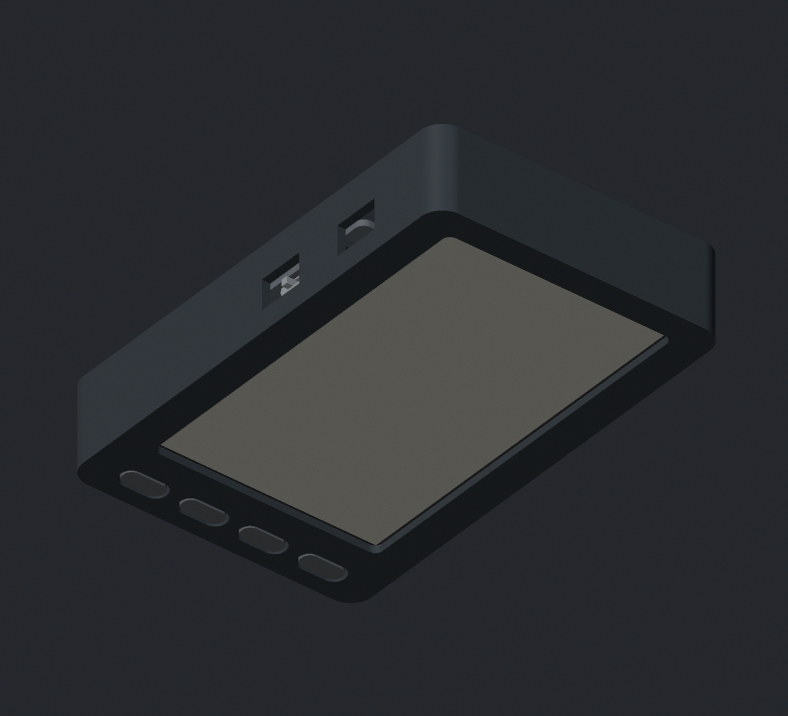
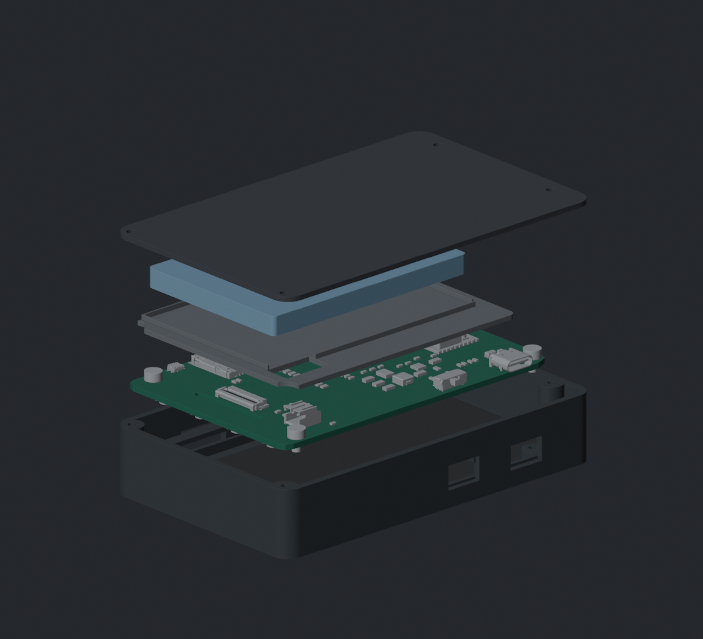
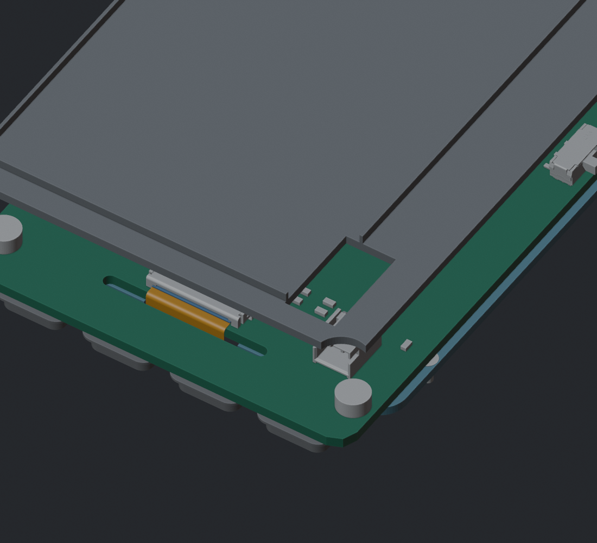
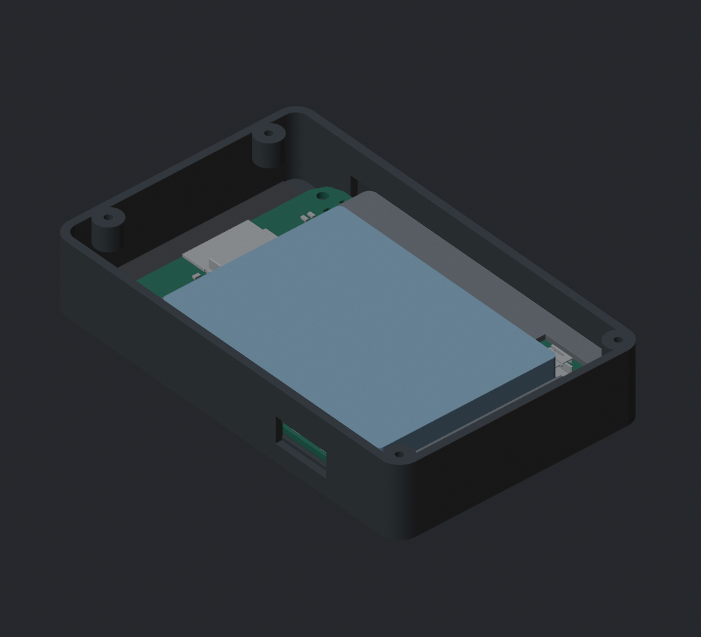
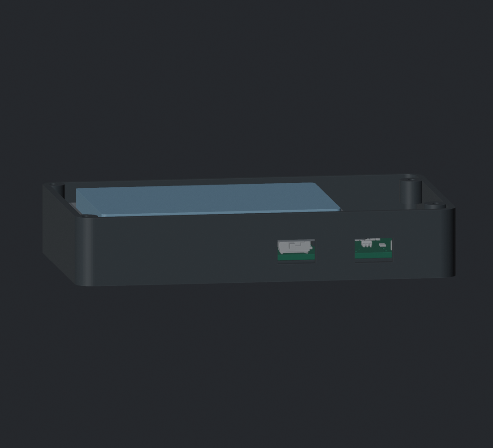

# ESP32 E-Reader Rev. B

A four-layer, battery-powered e-reader PCB built around the ESP32-C3 and a
high-resolution four-color e-paper display. This repository contains the
[tscircuit](https://tscircuit.com/) implementation of the Rev. B hardware,
including the schematic, PCB layout, component data, and fabrication export
workflow.

## At a glance

| Specification | Current design |
| --- | --- |
| Enclosure outside | 68.0 × 109.5 × **21.1 mm**; prototype CAD, not a measured print |
| PCB | 62.5 × 95.08 × 1.6 mm; four copper layers |
| Display | Waveshare 3.97inch e-Paper (G), raw display only; 480 × 800, four colors, no frontlight |
| Processor | ESP32-C3-WROOM-02U-N4; 4 MB flash, Wi-Fi, Bluetooth LE, external antenna |
| Storage | MicroSD over SPI |
| Battery | Protected 1-cell LiPo, 3.7 V nominal; modeled around 2000 mAh SparkFun PRT-13855 |
| Battery envelope | 49.2 × 68.8 × 5.6 mm nominal, excluding unverified lead and plug |
| USB | USB-C for charging and native ESP32-C3 USB data |
| Input | Four recessed navigation buttons, wake, reset, main power switch |

This repository is the **hardware and printable enclosure prototype**. It
does not contain e-reader firmware. Battery runtime, display cable fit, and
final printed fit have not been measured on an assembled device.





## Display

The specified display is the **Waveshare 3.97inch e-Paper (G), raw display only**. The [supplier product page](https://www.waveshare.com/product/displays/e-paper/3.97inch-e-paper-hat-plus-g.htm) offers the raw panel separately from the HAT driver board. Its [panel manual](https://files.waveshare.com/wiki/3.97inch_e-Paper_HAT%2B_G/3.97inch_e-Paper_G.pdf) includes a tail drawing and 24-pin assignment.

| Specification | Value |
| --- | --- |
| Display type | Reflective black, white, red, and yellow e-paper |
| Diagonal | 3.97 inches |
| Resolution | 480 × 800 pixels |
| Panel outline | 56.24 ± 0.10 × 96.62 ± 0.10 × 0.92 ± 0.10 mm |
| Active area | 51.84 × 86.40 mm |
| Controller | SSD2677 |
| Interface | 4-wire SPI |
| E-paper connector | 24-pin, 0.5 mm-pitch FPC (J2) |

J2 is a Hirose `FH12-24S-0.5SH(55)` connector. The board provides the panel's
SPI signals and the external high-voltage bias network required by the
SSD2677. This reflective display has no frontlight, so the former frontlight
connector and boost-driver circuit are not fitted.

The panel drawing puts the 12.50 mm-wide contact tip approximately 18 mm left
of panel center, with a 0.30 ± 0.05 mm stiffened end and 33.86 ± 0.30 mm of
FPC below the glass. J2 is centered at X = −18 mm and the 26 × 2 mm PCB slot
at X = −16 mm, Y = −36.2 mm, aligning the tail in plan view. The panel's
contacts face its back in the drawing; folding the tail to the component side
puts the contacts toward J2's bottom-contact terminals. A real panel must
still confirm fold radius, contact direction, insertion depth, and pin-1
orientation before a PCB order.

The 3D assembly includes an `assembly.screen` element attached to J2. Its
model shows the Waveshare outline and active area on the front of the PCB.
The flexible tail and its fold through the slot are not modeled.

> [!IMPORTANT]
> Do not select a panel based only on the “4.2-inch” description or the 24-pin
> connector. Many e-paper panels use similar FPCs but have different pinouts,
> resolutions, controllers, dimensions, and voltage requirements. The PCB and
> firmware must match the **Waveshare 3.97inch e-Paper (G) raw panel** pinout.
> An EastRising panel with similar glass dimensions is not a verified substitute.

## Hardware overview

| Function | Implementation |
| --- | --- |
| MCU | ESP32-C3-WROOM-02U-N4, 4 MB flash, Wi-Fi and Bluetooth LE |
| Display | Waveshare 3.97inch e-Paper (G) raw 480 × 800 four-color panel |
| Storage | MicroSD card over shared SPI |
| USB | USB-C power, native USB data, CC resistors, and USB ESD protection |
| Battery | Single-cell LiPo through a 2-pin JST-PH connector |
| Charging | BQ24074 power-path LiPo charger, 500 mA USB input limit |
| Battery protection | DW01A with FS8205A dual MOSFET |
| Logic supply | TPS63021 fixed 3.3 V buck-boost converter |
| Controls | Back, Confirm, Left, Right, Wake, Reset/Enable, and main power switch |
| Board | 62.5 × 95.08 mm, 1.6 mm thick, four copper layers |

### Parts and supplies for one prototype

| Item | Selection / requirement |
| --- | --- |
| U4 microcontroller | ESP32-C3-WROOM-02U-N4 with external U.FL antenna |
| Display | Waveshare 3.97inch e-Paper (G), raw display only |
| External antenna | Taoglas FXP75.07.0045B, 45 mm cable; rear-cover adhesive mount |
| J2 display connector | Hirose FH12-24S-0.5SH(55), 24 positions at 0.5 mm pitch |
| J4 MicroSD socket | Hirose DM3AT-SF-PEJM5 |
| J1 USB-C receptacle | GCT USB4105-GF-A |
| BT1 battery header | JST S2B-PH-K-S(LF)(SN), 2-pin, 2.0 mm pitch, side entry |
| Battery | Protected 3.7 V nominal single-cell pack; modeled PRT-13855, 2000 mAh, 49.2 × 68.8 × 5.6 mm |
| Navigation switches | 4 × Alps Alpine SKRPACE010, bottom-side assembly |
| Other controls | 2 × Panasonic EVQP7C01P (S1/S2); 1 × C&K JS102011SAQN (SW7) |
| Printed parts | Front shell, battery partition, rear cover, and 4 separate button caps |
| Assembly supplies | 2 suitable M2.5 PCB screws, 4 nominal M2.5 × 6 mm cover screws, display-safe perimeter adhesive, and thin nonconductive cell cushioning |

The [source component list and LCSC/JLCPCB mappings](design-data.ts) and the
[generated BOM](#fabrication-files) cover the remaining passives, charger,
protection devices, ESD device, and e-paper bias circuit. The USB-C body is
checked against the printable case using the local GCT manufacturer OBJ;
the display FPC fold, antenna cable, and mating plug remain unmodeled. Confirm the delivered display tail, battery plug polarity,
antenna cable path, and screw fit before assembly.

The four navigation buttons share one ESP32 ADC input through a resistor
ladder. The e-paper display and MicroSD card share the SPI clock and MOSI lines
while using independent chip-select signals. USB D+ and D− connect directly to
the ESP32-C3's native USB pins.

The four front navigation controls use the same **Alps Alpine SKRPACE010**
bottom-side tactile switch listed in the [original reader's
BOM](https://github.com/IS7V4N/ESP32_E-Reader). Each switch is 4.2 × 3.2 ×
2.5 mm, with 0.2 mm travel and 2.55 N operating force according to the
[manufacturer](https://tech.alpsalpine.com/e/products/category/tact-switch/sub/02/series/skrp/).
They sit on 14 mm centers within the 62.5 mm board width. Moving the row 4 mm
closer to the display removes 5 mm from the lower PCB edge while keeping about
2 mm between the panel outline and the button openings. Four separate slim
case caps reproduce the reference reader's recessed front-button appearance;
they are not hot-swappable. This requires bottom-side assembly. Printable caps
include a rear retention flange and nominal 0.14 mm clearance to the switch
body, but actuation and print fit need a physical prototype. Check the actual
display ribbon width and fold radius against the 26 mm FPC slot before ordering
the PCB.

## Dimensioned enclosure print prototype

The slim case has a **68.0 × 109.5 × 21.1 mm** outside envelope. From front
through back it contains the display, 62.5 × 95.08 mm PCB, a 1.4 mm rigid
partition, a protected 2000 mAh LiPo compartment, and a removable rear cover.
The case separates the battery from the component side of the board. The
selected [SparkFun PRT-13855 pack](https://www.sparkfun.com/lithium-ion-battery-2ah.html)
has published **49.2 × 68.8 × 5.6 mm nominal dimensions**. It sits left of BT1
in an extended guide pocket, with 1.5 mm nominal clearance to the rear cover.
The partition has a local opening for BT1 and its lead. BT1's side-entry
mating face points toward the opening, so the plug enters from the bottom of
the PCB before the partition is seated. The thinner front section moves the
display 1.5 mm closer to the PCB; check its short FPC fold on a real sample.
Verify BT1 polarity against the actual battery plug before connection.
SparkFun's store currently restricts international shipment of this pack;
equivalent 2000 mAh packs must be checked for the complete protected-pack
envelope, lead, plug, and polarity before substitution.

| Thickness contribution | mm |
| --- | ---: |
| Front outer face to PCB center | 6.5 |
| PCB center to battery base, including partition | 6.0 |
| Nominal battery thickness | 5.6 |
| Nominal battery-to-cover clearance | 1.5 |
| Rear cover | 1.5 |
| **Modeled outside thickness** | **21.1** |

The pack gives 2000 mAh in a 5.6 mm nominal thickness. A 1200 mAh, 5 mm
pack would save 0.6 mm in this stack but reduce rated capacity by 40%.
Actual runtime has not been measured; the buck-boost output and low-battery
shutdown threshold still need load testing. The [full coordinate and tolerance
table](assets/enclosure/PRINTING.md) describes the printed parts.



The [printable STL files and full dimension table](assets/enclosure/PRINTING.md)
include the shell, partition, rear cover, and four independent front caps.
The [component inventory](assets/enclosure/component-inventory.csv) lists
PCB references with footprint size and available 3D model envelopes.
The 3D assembly export omits the J1 USB-C body, but the clearance script checks
its local GCT OBJ against the case. The screen FPC fold, antenna cable, real
battery lead, and manufacturing tolerances remain unmodeled. The meshes
are manifold, but the first physical print and fit measurements remain
necessary before treating the case as a finished product.





The outer silhouette follows the [Xteink X3 product](https://www.xteink.com/products/xteink-x3)
and the original [Rev. B KiCad project](https://github.com/IS7V4N/ESP32_E-Reader),
whose enclosure source mesh is unpublished. The front navigation switches
remain low-profile tactile buttons, and motion controls remain a later
hardware revision. The power-switch side slot is open for access, but a
coupled thumb slider is not included in the printable set.

## Board construction

The layer arrangement is:

```text
Top      — components and signals
Inner 1  — GND plane
Inner 2  — 3.3 V plane
Bottom   — components and signals
```

Ground fills are also present on the top and bottom layers. U4 is the
external-antenna ESP32-C3-WROOM-02U variant. Its antenna cable leads to the
Taoglas FXP75 film modeled at X = 25, Y = 44 mm under the plastic rear cover.
The old PCB-antenna copper keepout has been removed.
The design requests 0.2 mm ordinary signal traces, 0.5 mm battery/USB/3.3 V
routes, and 0.4–0.6 mm e-paper charge-pump routes. Three J2-related signal
routes use 0.15 mm along their full length, despite the 0.2 mm request, to
clear the 0.5 mm contact pitch. Vias use 0.2/0.42 mm drill/pad
diameters.


## Repository layout

```text
.
├── index.circuit.tsx       # Board outline, planes, keepouts, and net routing
├── circuit-sections.tsx    # Functional schematic sections and components
├── design-data.ts          # Parts, placement, sourcing, nets, and trace widths
├── imports/                # Imported component footprints and models
├── __snapshots__/          # PCB, schematic, and 3D reference renders
├── assets/enclosure/       # Printable STLs, assembly GLBs, guide, and renders
├── scripts/                # Enclosure generation and clearance checks
├── tscircuit.config.json   # tscircuit project configuration
└── package.json            # Build, validation, and export commands
```

Placement, board geometry, and electrical intent are transcribed from the Rev. B KiCad
design; PCB routing is generated from the netlist by tscircuit's local
autorouter.

## Getting started

Install [Bun](https://bun.sh/) and then install the project dependencies:

```sh
bun install
```

Open the interactive tscircuit development view:

```sh
bun run dev
```

Type-check and build the design:

```sh
bun run typecheck
bun run build:pcb
```

`build:pcb` also generates a PCB preview image. For a longer release build with
an increased autorouter timeout, use:

```sh
bun run build:release
```

## Validation

Run the checks in this order so connectivity errors are caught before layout
and routing issues:

```sh
bunx tsci check netlist index.circuit.tsx
bunx tsci check schematic-placement index.circuit.tsx
bunx tsci check placement index.circuit.tsx
bunx tsci check trace-length index.circuit.tsx
bunx tsci check routing-difficulty index.circuit.tsx
bun run build:release
bunx tsci check shorts dist/index/circuit.json
```

Update the checked-in schematic, PCB, and 3D snapshots with:

```sh
bun run snapshot:update
```

The release build routes **226 traces with zero build DRC errors**; the
Gerber-derived shorts check reports **no shorts**. The enclosure meshes have
one connected shell each and no non-manifold edges. The modeled shell,
partition, cell, cover, button caps, and available component meshes have no
unintended solid intersections. See [mesh-check.json](assets/enclosure/stl/mesh-check.json)
and [clearance-check.json](assets/enclosure/stl/clearance-check.json).
These checks do not validate the display tail and bend,
battery lead and plug, button travel, or print tolerances.

`tsci check placement` reports zero placement errors and one connector-access
warning for J2. The heuristic expects a connector near the left board edge to
face that edge; the display ribbon instead folds through the dedicated PCB
slot to J2. Confirm the actual ribbon bend and insertion direction with a
sample panel before fabrication.

## Printable enclosure

The [print package](assets/enclosure/esp32-reader-printable-stls.zip)
contains the seven printable parts and the dimensioned guide. The separate
[STLs](assets/enclosure/stl/) and [print instructions](assets/enclosure/PRINTING.md)
are also available. Do **not** print the `battery-envelope-DO-NOT-PRINT` file;
it is a fit gauge.

To regenerate the meshes from source, install Blender and run:

```sh
blender --background --python scripts/generate-printable-enclosure.py
```

The generator updates the STL files, matching GLBs for the tscircuit
assembly, mesh checks, and ZIP package. The [print guide](assets/enclosure/PRINTING.md)
also gives the component-clearance and preview-render commands.

## Fabrication files

Generate the manufacturing archive with:

```sh
bun run build:release
bun run export:gerbers
```

`export:gerbers` uses the just-built `dist/index/circuit.json`, so it does not
routinely rerun the autorouter. The output is written to
`dist/esp32-e-reader-gerbers.zip` and includes the
four copper layers, solder mask, paste, silkscreen, fabrication and edge-cut
Gerbers, plated/non-plated drill files, BOM, and pick-and-place CSV files.
All BOM rows have JLCPCB part numbers, including the four SKRPACE010
navigation switches (C139797). U1, U2, U3, U4, U5, L2, SW2, SW3, SW4, and
SW6 use imported supplier footprints for assembly placement. `export:gerbers`
checks the BOM and critical placement rows before accepting the archive.

The exporter still warns about SW7 because its three straight-line pads do not
give the pin-1 detector a corner. SW7 uses the exact C221660 supplier footprint;
the [C&K terminal drawing](https://www.ckswitches.com/media/1434/slides.pdf)
shows terminal 1 at the left end of that row. With the footprint rotated 90° on
the board, pad 1 is the bottom pad. The export check requires SW7 on the top
side at 90°. Confirm the SW7 orientation in the assembler's placement preview.

> [!CAUTION]
> This is a prototype hardware design, not a certified consumer product. Review the
> schematic, battery polarity, component voltage ratings, PCB clearances, BOM,
> and fabrication outputs before ordering or powering a board. E-paper bias
> rails generate voltages well above the 3.3 V logic rail.

### Release checks requiring physical parts

The design changes below address the known schematic and drawing-level
blockers. **Do not release a full assembly order yet.** First mate a sample
Waveshare raw panel with J2 and confirm the FPC fold through the slot, pin 1,
contact side, and latch closure. Fit the exact protected battery and its keyed
plug in a printed case, then inspect the USB-C body, antenna cable, and lid
closure. On a prototype PCB, measure charge termination while reading,
3.3 V ripple and transient response at low battery, and Wi-Fi performance
with the lid and battery installed. The antenna choice may also require
regional RF compliance testing because its published 2.5 dBi peak gain
exceeds the module datasheet's certified-antenna gain limits. Programming,
screen refresh, SD I/O, and low-battery shutdown still need firmware bring-up.

## Power, charging, and bring-up

- U1 is a [BQ24074 power-path charger](https://www.ti.com/lit/ds/symlink/bq24074.pdf).
  Its BAT pins charge the cell while its separate OUT pins feed the reader.
  EN1 = high and EN2 = low select the 500 mA USB input-current limit.
  R9 = 2.5 kΩ sets about **356 mA** nominal fast-charge current
  (890 AΩ / 2500 Ω). Dynamic power management reduces charging when the
  system uses more of the USB budget. R31 = 10 kΩ holds TS in its valid
  no-thermistor range; the two-wire pack provides no cell temperature signal.
  Charge only within the pack's specified temperature range, and verify the
  pack's allowed rate. Confirm actual current, termination, and thermal
  behavior with and without system load on a prototype. Battery-free operation
  also needs a load test: the 500 mA USB input budget may not cover simultaneous
  Wi-Fi, SD-card, and display peaks.
- SW7 drives U5's EN pin from `SYS_OUT`; it does not carry load current.
  This lets the regulator turn on from either a connected battery or USB.
  S2 remains a firmware-controlled wake button.
- U5 is the [TPS63021 fixed 3.3 V buck-boost
  converter](https://www.ti.com/lit/ds/symlink/tps63021.pdf). L2 is a
  shielded 1.5 µH inductor rated 5 A, with two 10 µF input capacitors and
  three nominal 22 µF/25 V output capacitors close to U5. The converter
  operates from the charger OUT node whether USB is present or not. Check
  the effective ceramic capacitance under DC bias, the switching loop, rail
  ripple, and transient response at the actual Wi-Fi, SD, and display loads.
- R30 pulls ESP32-C3 GPIO8 high on the MCU side of the 20 Ω SPI-clock series
  resistor R27. Closing JP1 pulls GPIO9 low for ROM download mode; GPIO8 must
  remain high through reset. Test programming with the display and SD card
  connected, then open JP1 and confirm normal boot. See the
  [ESP32-C3 boot-mode table](https://docs.espressif.com/projects/esp-hardware-design-guidelines/en/latest/esp32c3/schematic-checklist.html).
- Measure battery voltage at TP1 and 3.3 V at TP2 during low-state-of-charge
  Wi-Fi transmit, SD writes, and display refresh. Set a firmware low-battery
  shutdown threshold with margin above the battery protection cutoff. This
  repository does not implement that firmware.
