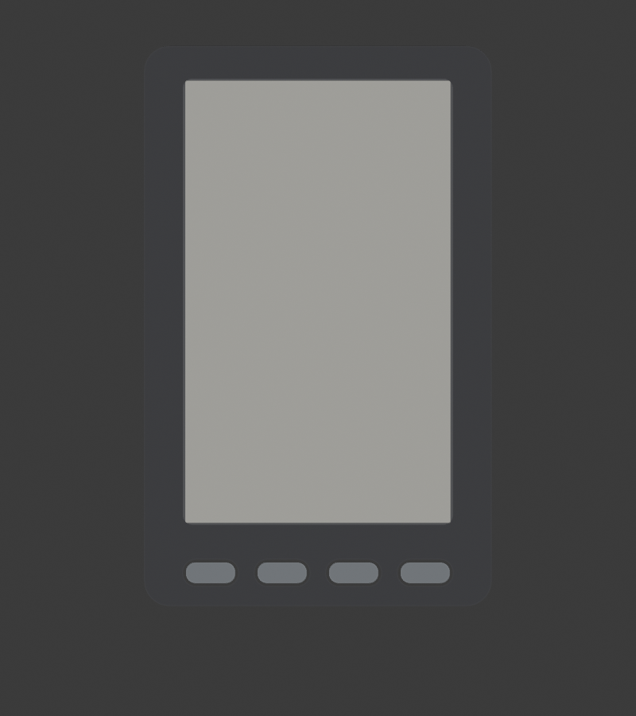
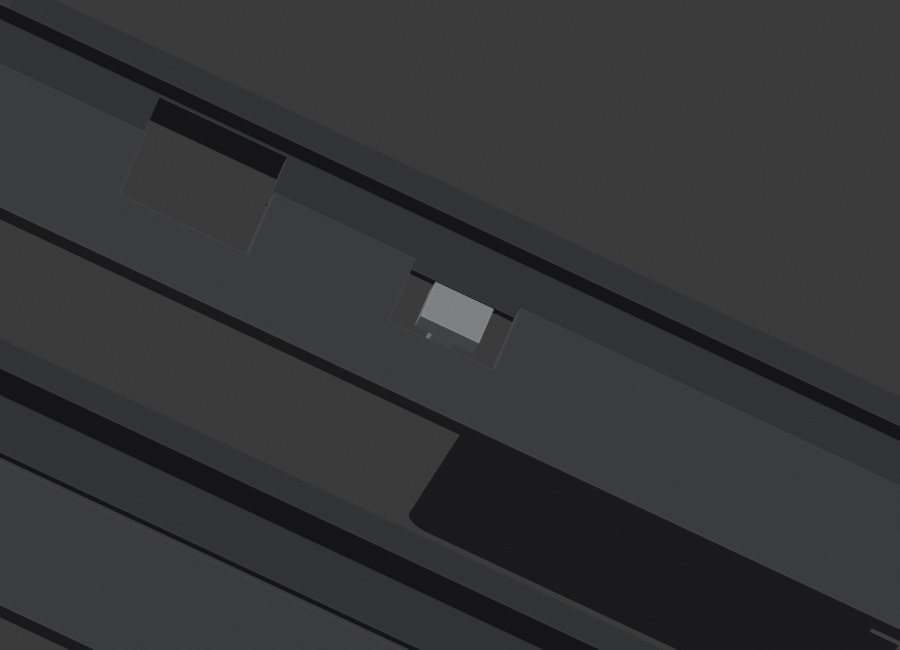

# ESP32 E-Reader Rev. B

A four-layer, battery-powered e-reader PCB built around the ESP32-C3 and a
high-resolution four-color e-paper display. This repository contains the
[tscircuit](https://tscircuit.com/) implementation of the Rev. B hardware,
including the schematic, PCB layout, component data, and fabrication export
workflow.




## Display

The intended display is the **EastRising ER-EPD3.97-1RY**.

| Specification | Value |
| --- | --- |
| Display type | Reflective black, white, red, and yellow e-paper |
| Diagonal | 3.97 inches |
| Resolution | 480 × 800 pixels |
| Panel outline | 56.24 × 96.62 × 0.9 mm |
| Active area | 51.84 × 86.40 mm |
| Controller | SSD2677 |
| Interface | 4-wire SPI |
| E-paper connector | 24-pin, 0.5 mm-pitch FPC (J2) |

J2 is a Hirose `FH12-24S-0.5SH(55)` connector. The board provides the panel's
SPI signals and the external high-voltage bias network required by the
SSD2677. This reflective display has no frontlight, so the former frontlight
connector and boost-driver circuit are not fitted.

The centered 26 × 2 mm PCB slot allows a display FPC to pass from the front of
the assembly to J2 immediately above it on the component side. Moving J2
about 12 mm toward the slot shortens the required folded tail path. The
MicroSD socket is higher on the left edge, with its enclosure opening moved
to match. A panel whose integral tail cannot reach J2 still requires a
24-conductor, 0.5 mm-pitch extension cable and a compatible FPC/FFC coupler.
Select the cable contact orientation (same-side or
opposite-side contacts) only after checking pin 1 at both the display tail and
J2; reversing the contact orientation reverses the pin order. The supplier
lists this panel's connection as a soldering FPC, so confirm the actual tail
is compatible with the selected ZIF connector before ordering the board.

The 3D assembly includes an `assembly.screen` element attached to J2. Its
model shows the [EastRising panel outline and active-area
dimensions](https://www.buydisplay.com/3-97-inch-quad-color-e-paper-screen-e-ink-display-480x800)
on the front side of the PCB. The flexible tail and its fold through the slot
are not modeled.

> [!IMPORTANT]
> Do not select a panel based only on the “4.2-inch” description or the 24-pin
> connector. Many e-paper panels use similar FPCs but have different pinouts,
> resolutions, controllers, dimensions, and voltage requirements. The PCB and
> firmware are designed for the **ER-EPD3.97-1RY** pinout. Verify the full
> part number before purchasing or connecting a display.

## Hardware overview

| Function | Implementation |
| --- | --- |
| MCU | ESP32-C3-WROOM-02-N4, 4 MB flash, Wi-Fi and Bluetooth LE |
| Display | EastRising ER-EPD3.97-1RY, 480 × 800 four-color e-paper |
| Storage | MicroSD card over shared SPI |
| USB | USB-C power, native USB data, CC resistors, and USB ESD protection |
| Battery | Single-cell LiPo through a 2-pin JST-PH connector |
| Charging | MCP73831-2 linear LiPo charger |
| Battery protection | DW01A with FS8205A dual MOSFET |
| Logic supply | ME6211C33M5 3.3 V LDO |
| Controls | Back, Confirm, Left, Right, Wake, Reset/Enable, and main power switch |
| Board | 62.5 × 95.08 mm, 1.6 mm thick, four copper layers |

The four navigation buttons share one ESP32 ADC input through a resistor
ladder. The e-paper display and MicroSD card share the SPI clock and MOSI lines
while using independent chip-select signals. USB D+ and D− connect directly to
the ESP32-C3's native USB pins.

The four front navigation controls use the same **Alps Alpine SKRPACE010**
bottom-side tactile switch listed in the [original reader's
BOM](https://github.com/IS7V4N/ESP32_E-Reader). Each switch is 4.2 × 3.2 ×
2.5 mm, with 0.2 mm travel and 2.55 N operating force according to the
[manufacturer](https://tech.alpsalpine.com/e/products/category/tact-switch/sub/02/series/skrp/).
They sit on 14 mm centers within the 62.5 mm board width. Moving the row 4 mm
closer to the display removes 5 mm from the lower PCB edge while keeping about
2 mm between the panel outline and the button openings. Four separate slim
case caps reproduce the reference reader's recessed front-button appearance;
they are not hot-swappable. This requires bottom-side assembly. The cap stems,
retention, button travel, and print tolerances are visual concepts that need
a physical prototype before the enclosure can be fabricated. Check the actual
display ribbon width and fold radius against the 26 mm FPC slot before ordering
the PCB.

## Compact enclosure direction

The enclosure preview takes its straight-sided, rounded pocket-reader shape
from the [Xteink X3 product](https://www.xteink.com/products/xteink-x3). The
four recessed front buttons echo the source board and the dedicated physical
page buttons of the [Kindle Oasis](https://www.aboutamazon.com/news/devices/read-anywhere-with-the-all-new-kindle-oasis).
The visual shell is **68 × 109.5 mm**, versus the X3's published **63.7 × 97.6
mm**. It spans about 20.7 mm in thickness including the button caps and back.
The narrower shell leaves about 5.9 mm from each side of the panel outline to
the outside edge. The PCB remains 62.5 mm wide because its mounting holes and
edge connectors are already close to its sides; the modeled cavity has 0.75 mm
of nominal clearance on each side of the board. These are concept dimensions,
not validated manufacturing clearances.
Shake-to-turn and its motion sensor are left for a later hardware revision.

## Battery and enclosure visual reference

The battery connection is **BT1**, the side-entry two-pin JST-PH header on
the component side below the planned battery bay. Its mating plug is a
two-position PH housing such as [JST
PHR-2](https://order.jst-mfg.com/InternetShop/app/pdf_show.php?kbn=1&key=ePH.pdf)
with properly crimped contacts. In this circuit, BT1 pin 1 is `BATT_P` and pin
2 is `BATT_N_RAW`; verify the finished battery cable's polarity against those
pins before plugging it in. A one-cell LiPo connects to BT1; USB-C powers U1,
the on-board charger. Charge with SW7 OFF as described under Hardware notes.

The selected size target is the [Adafruit 1578 3.7 V, 500 mAh protected
LiPo](https://www.adafruit.com/product/1578), whose nominal body is
**29 × 36 × 4.75 mm** and whose lead is 102 mm long. The 3D model places that
nominal body behind the upper PCB, above a 31 × 38 mm shelf and clear of the
tactile switches in plan view. BT1 is just below the bay, shortening the
lead route. The panel outline starts about 1.7 mm below the case top; the
visible window starts about 6.4 mm below it. The nominal model leaves 1.25 mm
between the pack and the inside of the rear cover.
Confirm the actual pack's dimensions, lead routing, insulation, swelling
space, shelf support, and clearance over components and the ESP32 antenna
before fabrication. The model represents the nominal cell body, not a
validated mechanical or thermal envelope. The existing charger setting is
about 400 mA; measure it on a prototype and verify that the supplied pack and
connector polarity match this circuit before connecting the battery.

The 3D view includes a front bezel on the display side, an open rear tray
around the PCB, a battery envelope, and a side power-slider preview through
tscircuit's `assembly.cadassembly` elements. The rear cover is a separate
`assets/enclosure/rear-cover.glb` model and is omitted from the default 3D
view so the board remains visible. It is a removable case part, rather than
another PCB or display layer. All enclosure models are generated from
`scripts/generate-enclosure.py`.

The rear tray's USB-C, MicroSD, and power-switch openings now pass all the
way through their side walls. A separate thumb slider is shown at the right
edge, spanning the gap from the outer wall toward SW7. The selected
[C&K JS102011SAQN](https://www.ckswitches.de/media/1434/slides.pdf) has
2 mm of travel along the board edge. The slider's guide, coupling to the
switch, and fit in the case are only a visual proposal; verify these with a
physical switch and printed prototype before treating the power control as
accessible in a manufactured enclosure.



These are **visual reconstructions**, informed by the [original Rev. B KiCad
project](https://github.com/IS7V4N/ESP32_E-Reader), its [front enclosure
photo](https://github.com/IS7V4N/ESP32_E-Reader/blob/main/Hardware/Images/ESP32Ereader-cover.png),
and its [open-back
photo](https://github.com/IS7V4N/ESP32_E-Reader/blob/main/Hardware/Images/Backplate_off.jpg).
The original repository currently marks `Hardware/3D CAD` as work in progress
and does not publish its enclosure mesh. These models are not the original
snap-fit parts; the tactile-button caps and battery bay are new design
proposals. They have not been checked for print tolerances, button travel,
display clearance, or assembly fit. Regenerate them with
`blender --background --python scripts/generate-enclosure.py`.

## Board construction

The layer arrangement is:

```text
Top      — components and signals
Inner 1  — GND plane
Inner 2  — 3.3 V plane
Bottom   — components and signals
```

Ground fills are also present on the top and bottom layers. The
ESP32-C3-WROOM-02 antenna area has a keepout across all four copper layers.
The design uses 0.2 mm signal traces, wider power and e-paper charge-pump
routes, and 0.2/0.42 mm via drill/pad diameters.


## Repository layout

```text
.
├── index.circuit.tsx       # Board outline, planes, keepouts, and net routing
├── circuit-sections.tsx    # Functional schematic sections and components
├── design-data.ts          # Parts, placement, sourcing, nets, and trace widths
├── imports/                # Imported component footprints and models
├── __snapshots__/          # PCB, schematic, and 3D reference renders
├── tscircuit.config.json   # tscircuit project configuration
└── package.json            # Build, validation, and export commands
```

The design currently contains 86 components and 49 connected nets. Placement,
board geometry, and electrical intent are transcribed from the Rev. B KiCad
design; PCB routing is generated from the netlist by tscircuit's local
autorouter.

## Getting started

Install [Bun](https://bun.sh/) and then install the project dependencies:

```sh
bun install
```

Open the interactive tscircuit development view:

```sh
bun run dev
```

Type-check and build the design:

```sh
bun run typecheck
bun run build:pcb
```

`build:pcb` also generates a PCB preview image. For a longer release build with
an increased autorouter timeout, use:

```sh
bun run build:release
```

## Validation

Run the checks in this order so connectivity errors are caught before layout
and routing issues:

```sh
bunx tsci check netlist index.circuit.tsx
bunx tsci check schematic-placement index.circuit.tsx
bunx tsci check placement index.circuit.tsx
bunx tsci check trace-length index.circuit.tsx
bunx tsci check routing-difficulty index.circuit.tsx
bunx tsci check shorts index.circuit.tsx
```

Update the checked-in schematic, PCB, and 3D snapshots with:

```sh
bun run snapshot:update
```

## Fabrication files

Generate the manufacturing archive with:

```sh
bun run export:gerbers
```

The output is written to `dist/esp32-e-reader-gerbers.zip` and includes the
four copper layers, solder mask, paste, silkscreen, fabrication and edge-cut
Gerbers, plated/non-plated drill files, BOM, and pick-and-place CSV files.

> [!CAUTION]
> This is an open hardware design, not a certified consumer product. Review the
> schematic, battery polarity, component voltage ratings, PCB clearances, BOM,
> and fabrication outputs before ordering or powering a board. E-paper bias
> rails generate voltages well above the 3.3 V logic rail.

## Design notes

- Battery, USB, and 3.3 V distribution use 0.5 mm routes.
- Pulsed e-paper charge-pump paths use 0.4–0.6 mm routes.
- Ordinary logic uses 0.2 mm routes.
- The top, bottom, and inner-1 copper layers have GND fills; inner-2 is the
  dedicated 3.3 V plane.
- SW7 is the hard main-power control. It switches the ME6211 LDO enable input
  between the battery rail and an off-state pull-down, so the switch does not
  carry the ESP32 or display load current. S2 remains a firmware wake/power
  button.
- Charge the battery only with SW7 **OFF** and a battery connected. U1 is an
  MCP73831 charger; its VBAT output also feeds U5 and the system. There is no
  power-path/load-sharing circuit, so operating the reader while charging can
  disturb charge termination. USB-only operation without a battery is not
  supported. A future revision intended for simultaneous charging and use
  needs a dedicated power path, such as an integrated load-sharing charger.
  SW7 does not electrically interlock charging and operation; this is an
  operating requirement.
- R30 pulls ESP32-C3 GPIO8 high on the MCU side of the 20 Ω SPI-clock series
  resistor R27. Closing JP1 pulls GPIO9 low for ROM download mode; GPIO8 must
  stay high when reset is released. During bring-up, connect the display and SD
  card, close JP1, reset with S1, confirm USB ROM download/programming works,
  then open JP1 and confirm normal boot. Check GPIO8 at U4 during reset if
  programming is unreliable. See the [ESP32-C3 boot-mode table](https://docs.espressif.com/projects/esp-hardware-design-guidelines/en/latest/esp32c3/schematic-checklist.html).
- U5 is a 3.3 V LDO, so V3V3 cannot remain regulated through the full LiPo
  discharge range. The ESP32-C3 module requires 3.0–3.6 V at its supply; the
  LDO also needs load-dependent dropout headroom. The minimum usable battery
  voltage has **not** been verified. Before field use, measure battery voltage
  at TP1 and V3V3 at TP2 during Wi-Fi transmit, SD writes, and display refresh
  at low state of charge. Set a firmware low-battery shutdown threshold that
  keeps V3V3 above 3.0 V and within every peripheral's specified range under
  those loads, with margin. The firmware threshold is not implemented in this
  hardware repository. Use a buck-boost supply if operation through the full
  cell discharge range is required. See
  the [ESP32-C3-WROOM-02 supply specification](https://documentation.espressif.com/esp32-c3-wroom-02_datasheet_en.html)
  and [ME6211 datasheet](https://datasheet.lcsc.com/szlcsc/Nanjing-Micro-One-Elec-ME6211C33M5G-N_C82942.pdf).
- Imported EasyEDA footprints live in `imports/`; any source-orientation
  corrections are applied there.
